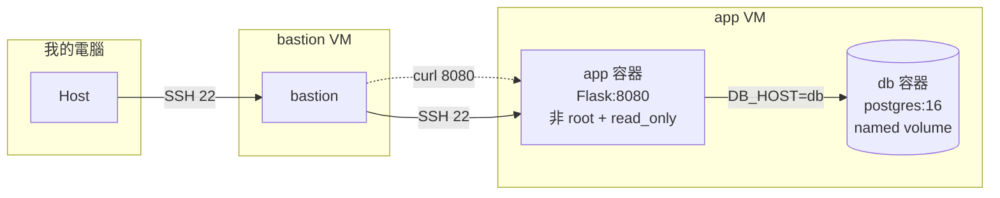

# 期末實作 — 412631060 莊佩欣

## 1. 架構總覽

    
#### 本專案採用跳板機（Bastion Host）架構以確保安全性。外部用戶僅能透過 SSH 連線至 bastion 主機，再由 bastion 轉發指令至後端的 app 與 db 容器。此隔離機制限制了容器對外直接暴露的風險，所有連線皆經由嚴格的網路權限控管，確保應用程式與資料庫在 Host-only 的虛擬環境中維持高度安全性。

## 2. Part A：底座與基準點

#### <ssh證據 + 版本>

#### <snapshot>

## 3. Part B：Dockerfile 與快取

#### <兩次 build 對照>

> 第一次build

> 第二次build

### 為什麼聽 8080 不聽 80？
A:在 Linux系統的預設規定中，1-1023的埠號（例如標準網頁的80埠）被歸類為「特權連接埠」，作業系統基於安全考量，規定只有具備最高管理員權限的root身份才能佔用並監聽它們。然而，因為安全硬化的要求，我們在 Dockerfile 中加入了 USER appuser指令，這會在容器啟動時，自動將執行身份從預設的root降級成完全沒有核心特權的一般普通使用者appuser，藉此達成縱深防禦、防止駭客打穿網站直接控制整台 VM。但也因為身份變成了非特權使用者，此時如果 Flask 程式還硬去聽80埠，就會直接被Linux核心阻擋並噴出 Permission Denied權限不足的錯誤，導致容器崩潰。因此，我們必須將監聽埠改為大於1024、一般普通使用者也能自由使用的「非特權連接埠」（如 8080），網頁才能順利在非root狀態下安全地跑起來。

## 4. Part C：Compose 與資料持久化

#### <三段對照>

> 第一階段（初始建立狀態）

> 第二階段（砍容器重建->結果還在）

> 第三階段（連 volume一起砍->結果消失）

> 第四階段（重寫）

### down 跟 down -v 差在哪？named volume 的生命週期跟著誰？
A:當只用「docker compose down」，系統只會把跑起來的容器和虛擬網路給砍了。但是最核心的數據硬碟會被完好地留在原地。在第二階段做實驗時，把容器 down 掉再重蓋，進去資料庫看，學號依然還在；而當加上 -v「docker compose down -v」，這就是徹底的毀滅模式。除了砍容器，它還會順便把底下的named volume整個去除。所以第三階段執行完，進資料庫查就會噴錯誤，因為存放資料的硬碟已經被系統收走了。所以，named volume的生命週期完全是獨立的。它不會盲目地跟著容器同生共死。容器存在不見、Down 掉重蓋，Volume 都會依然帶著資料活在Docker宿主機的核心管理裡；除非執行 -v 這個命令，或者是手動輸入docker volume rm，不然它的生命週期是會一直延續下去的。

## 5. Part D：生產化加固
<權限驗證輸出 + cgroup 讀值對照表>
### yaml 的值怎麼對回 cgroup 檔案？

## 6. Part E：故障演練
### 故障 1：<F1–F4 擇一>
- 注入方式：
- 故障前：
- 故障中：
- 回復後：
- 診斷推論：

### 故障 2：<另一個>
（同上）

### 三症狀分層表（必答）
| 症狀 | 最可能的層 | 第一條驗證命令 |
| ---- | ---------- | -------------- |
| timeout |  |  |
| connection refused |  |  |
| HTTP 503 |  |  |

## 7. 反思（200 字）
這學期從 VM 做到 production-ready 容器，「隔離」這個概念在 VM、namespace、
cgroup、權限階梯四個地方各出現一次——它們在防的東西一樣嗎？

