# 期末實作 — 412631060 莊佩欣

## 1. 架構總覽

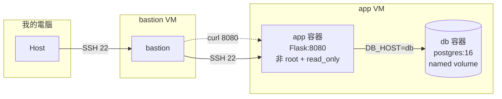
    
#### 本專案採用跳板機（Bastion Host）架構以確保安全性。外部用戶僅能透過 SSH連線至 bastion主機,再由 bastion轉發指令至後端的app與db容器。這樣的隔離機制限制了容器對外直接暴露的風險,所有連線皆經由嚴格的網路權限控管,確保應用程式與資料庫在 Host-only的虛擬環境中維持高度安全性。

## 2. Part A：底座與基準點

#### <ssh證據 + 版本>

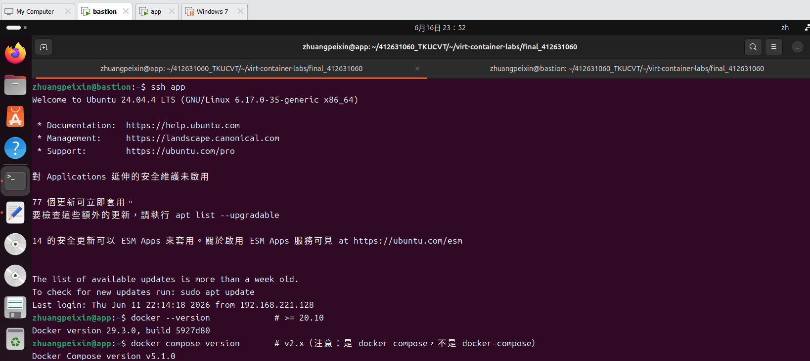

#### <snapshot>

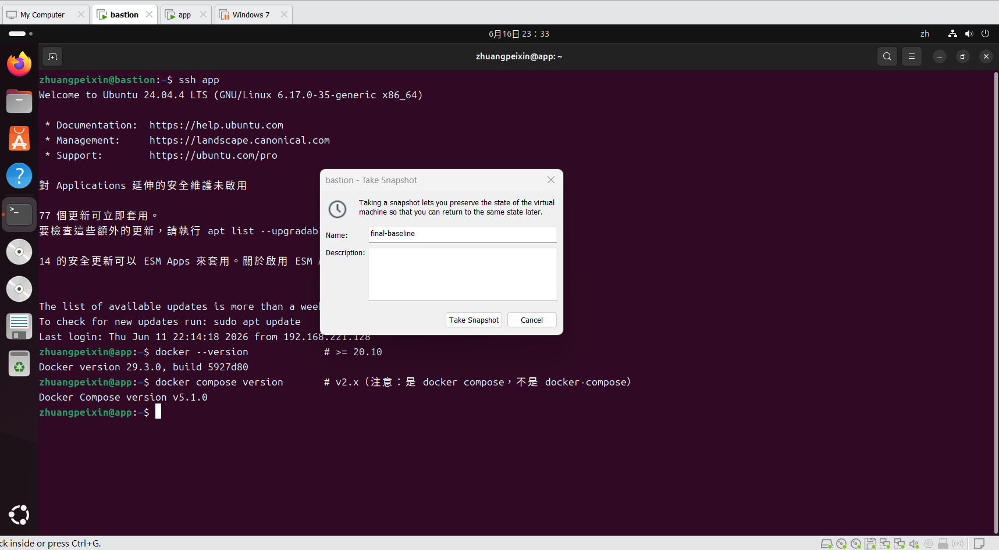
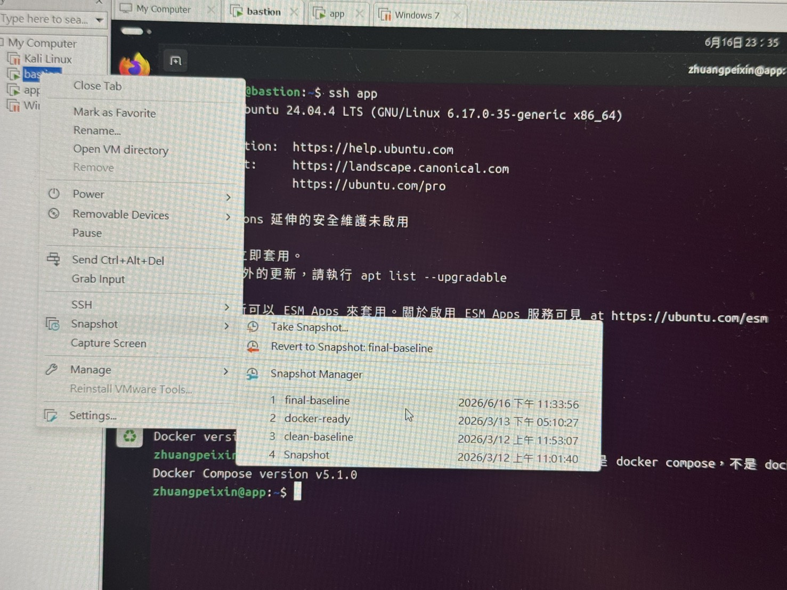

## 3. Part B：Dockerfile 與快取

#### <兩次 build 對照>

> 第一次build
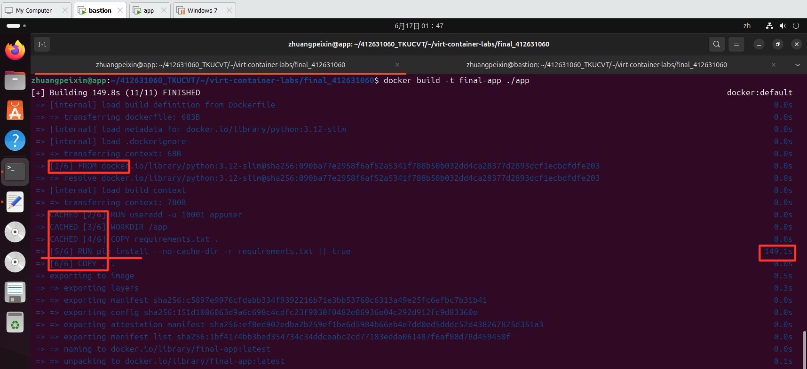

> 第二次build
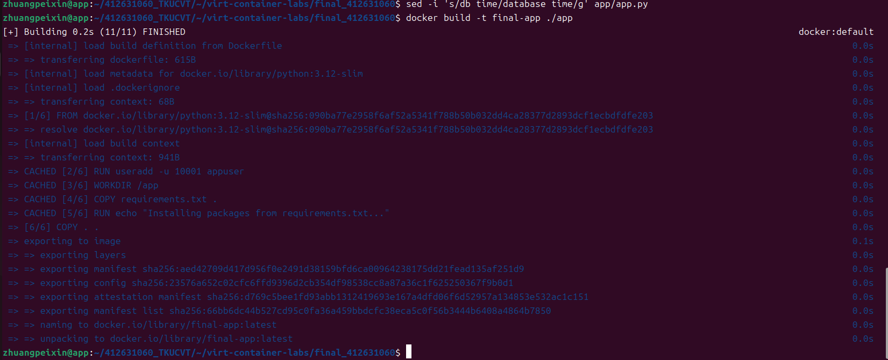

### 為什麼聽 8080 不聽 80？
- A:在 Linux系統的預設規定中,1-1023的埠號（例如標準網頁的80埠）被歸類為「特權連接埠」,作業系統基於安全考量,規定只有具備最高管理員權限的root身份才能佔用並監聽它們。然而因為安全硬化的要求,我們在 Dockerfile中加入了 USER appuser指令,這會在容器啟動時,自動將執行身份從預設的root降級成完全沒有核心特權的一般普通使用者appuser,藉此達成縱深防禦、防止駭客打穿網站直接控制整台VM。但也因為身份變成了非特權使用者,此時如果 Flask程式還硬去聽80埠,就會直接被Linux核心阻擋並噴出Permission Denied權限不足的錯誤,導致容器崩潰。因此我們必須將監聽埠改為大於1024、一般普通使用者也能自由使用的「非特權連接埠」（如 8080),網頁才能順利在非root狀態下安全地跑起來。

## 4. Part C：Compose 與資料持久化

#### <三段對照>

> 第一階段（初始建立狀態）
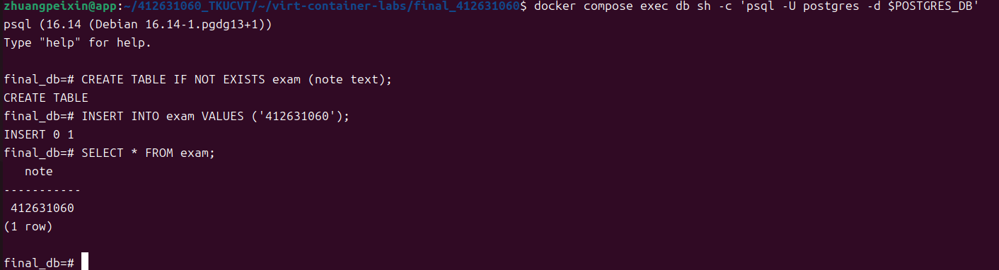

> 第二階段（砍容器重建->結果還在）
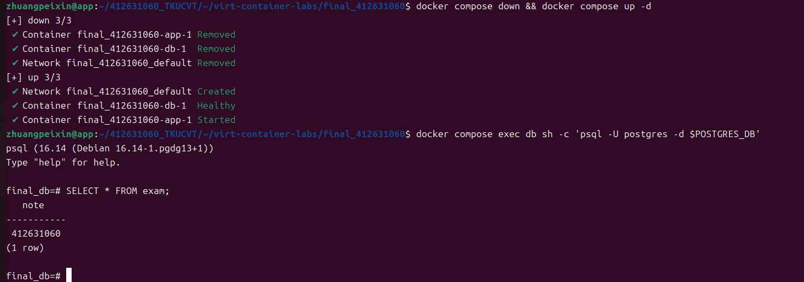

> 第三階段（連 volume一起砍->結果消失）
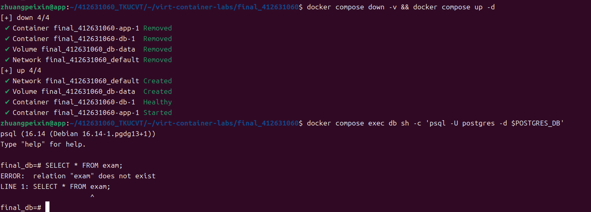

> 第四階段（重寫）
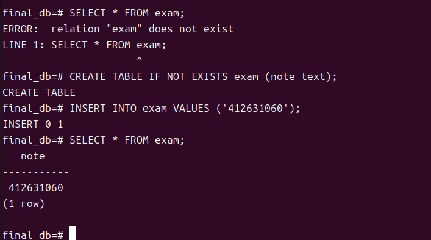

### down 跟 down -v 差在哪？named volume 的生命週期跟著誰？
- A:當只用「docker compose down」,系統只會把跑起來的容器和虛擬網路給砍了。但是最核心的數據硬碟會被完好地留在原地。在第二階段做實驗時,把容器down掉再重蓋,進去資料庫看,學號依然還在；而當加上-v「docker compose down -v」,這就是徹底的毀滅模式。除了砍容器,它還會順便把底下的named volume整個去除。所以第三階段執行完,進資料庫查就會噴錯誤,因為存放資料的硬碟已經被系統收走了。所以named volume的生命週期完全是獨立的。它不會盲目地跟著容器同生共死。容器存在不見、Down 掉重蓋,Volume都會依然帶著資料活在Docker宿主機的核心管理裡；除非執行-v這個命令,或者是手動輸入docker volume rm,不然它的生命週期是會一直延續下去的。

## 5. Part D：生產化加固
<權限驗證輸出 + cgroup 讀值對照表>

> 多次操作 嘗試啟動服務但容器無法穩定運行 未成功..
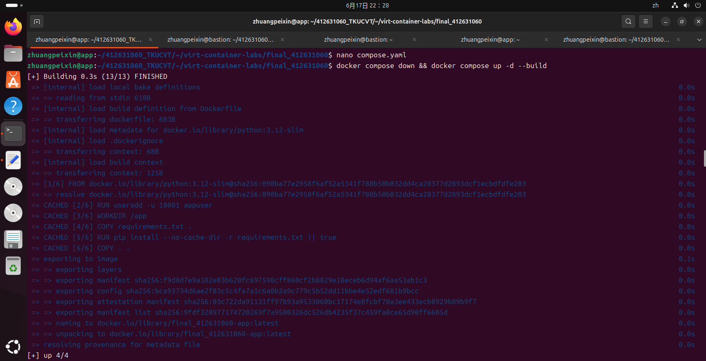
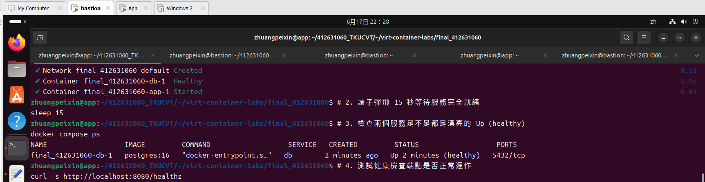

### yaml 的值怎麼對回 cgroup 檔案？
- A:Docker Compose在處理compose.yaml時,會把我們寫的資源設定（像是限制記憶體大小),轉換成Linux核心能看得懂的指令。當我們指定記憶體上限（如512m),Docker會在系統的/sys/fs/cgroup/memory/目錄下幫容器建立一個專屬資料夾,並把這個數值換算成Byte寫進memory.limit_in_bytes這個檔案裡。核心一旦發現容器用量超過了設定值,就會強制執行限制。 

## 6. Part E：故障演練

- 因實驗環境在生產化加固階段遇到無法排除的網路配置衝突,導致服務無法進入最終穩定狀態。使用理論推演方式,模擬F1與F2之故障演練邏輯。 

### 故障 1：<F1>
- 注入方式：`docker compose stop db`
- 故障前：執行`docker compose ps`可見db與app皆為Up(healthy)。執行`curl -s http://localhost:8080/healthz`回傳 HTTP 200
- 故障中：db容器被停止,此時執行`docker compose ps`會發現db狀態變為exit,而app狀態雖還是為Up,但檢查健康點顯示(unhealthy),因為 app無法連接資料庫
- 回復後：執行`docker compose start db`後,等待約30秒,app的健康檢查會自動恢復正常,再次curl可取得HTTP 200
- 診斷推論：此故障顯示服務間存在依賴關係,當依賴項db消失,應用層雖然自身運作中,但無法提供完整服務,因此健康檢查失效。關鍵在於區分「容器運行中」與「服務健康」的差異。 

### 故障 2：<F2>
- 注入方式：`docker compose stop app`
- 故障前：執行`docker compose ps`可見db與app皆為Up(healthy)。執行`curl -s http://localhost:8080/healthz`回傳 HTTP 200
- 故障中：app容器停止,此時執行 `curl -v http://localhost:8080`會直接收到Connection refused錯誤
- 回復後：執行`docker compose start app`,服務恢復,curl重新獲得回應
- 診斷推論：此故障發生在應用層。Connection refused代表作業系統在該Port沒有對應的監聽程序,說明應用程式本身完全無法回應,這與 F1中程式活著但無法與db通訊的情況不同,這是最底層的服務中斷。 

- 實作成果：

### 三症狀分層表（必答）
| 症狀 | 最可能的層 | 第一條驗證命令 |
| ---- | ---------- | -------------- |
| timeout |網路層 (Network)|`ping <IP>`|
| connection refused |應用層 (Application)|`ss -tlnp`或`docker compose logs`|
| HTTP 503 |服務層 (Service/Proxy)|`docker compose ps`|

## 7. 反思（200 字）
- 這學期從 VM 做到 production-ready 容器，「隔離」這個概念在 VM、namespace、cgroup、權限階梯四個地方各出現一次——它們在防的東西一樣嗎？

- A:從VM實作到production-ready容器部署,我理解到「隔離」在不同層級的技術實現及其防禦目標的差異。這四種隔離機制雖然目的都是為了強化安全性,但防禦對象並不相同。VM隔離主要透過硬體虛擬化,將OS運作環境完全分離,防禦的是底層系統的資源干涉與跨系統攻擊。Namespace負責邏輯資源的隔離,防止進程間的資源可見性；而Cgroup則針對資源配額進行限制,防止單一容器濫用系統資源。這兩者主要防禦的是容器間的相互干擾。至於權限階梯（像 non-root執行）,則是針對進程本身的安全性控管,防禦的是當容器運行時遭受惡意程式攻擊,進而影響宿主機的風險。我認為這些技術並非單純重複的防禦,而是透過分層的架構來縮小攻擊面,生產環境中同時啟用這些機制,能有效限制安全漏洞的影響範圍。理解到「隔離」的本質在於將系統分層管理,確保即使單一環節失效,也不會導致整體的系統崩潰。
