# 期中實作 — 412631060 莊佩欣

## 1. 架構與 IP 表

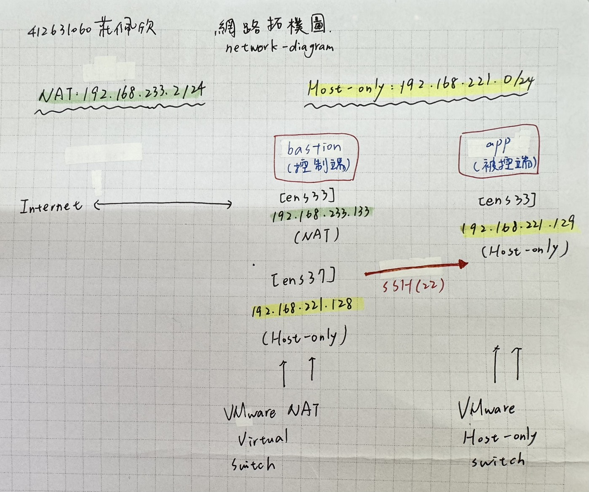

## 2. Part A：VM 與網路

#### [ip -4 addr show 與 兩端互ping]

> bastion
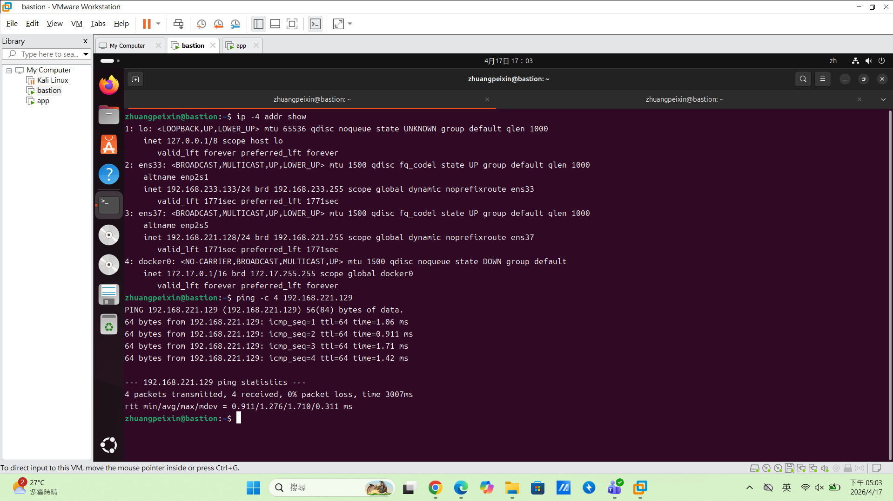

> app
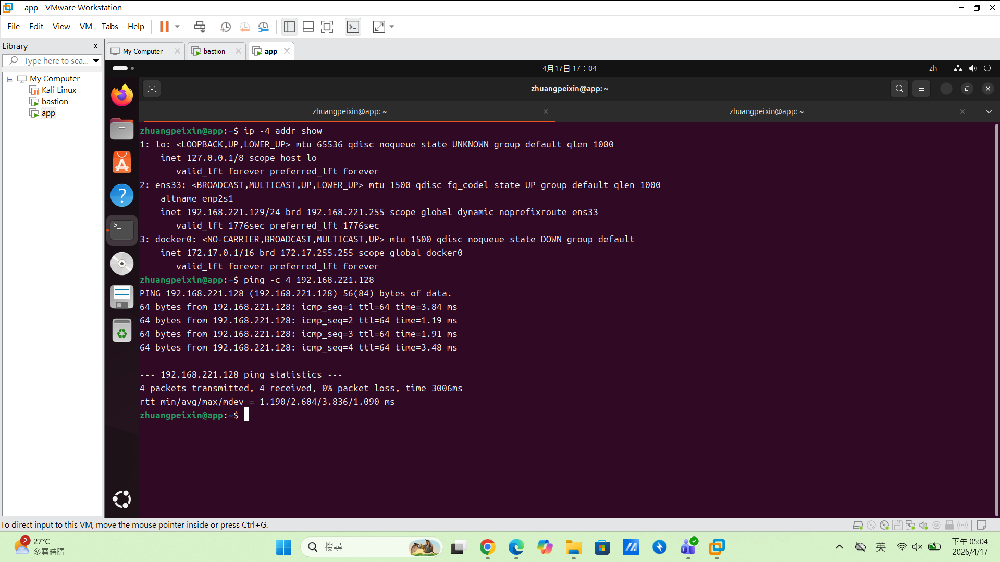

## 3. Part B：金鑰、ufw、ProxyJump

#### [防火牆規則]

> bastion
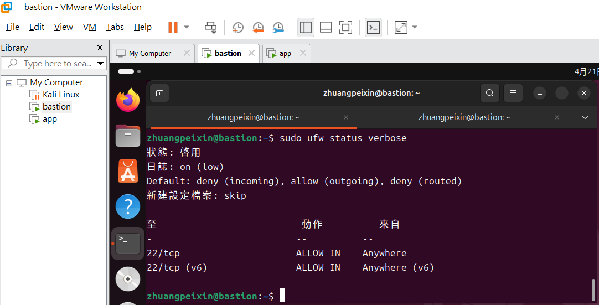

> app
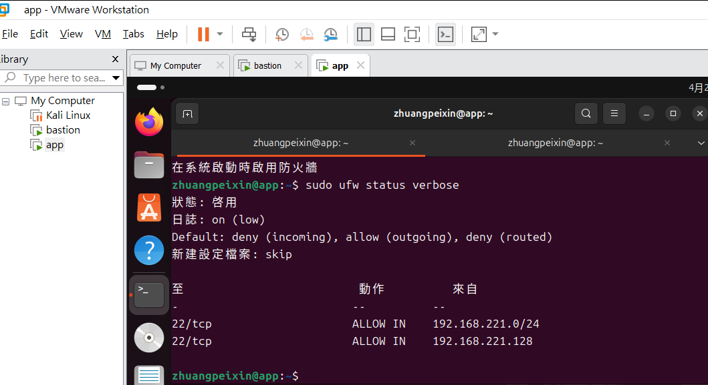

#### [ssh app成功]

> app
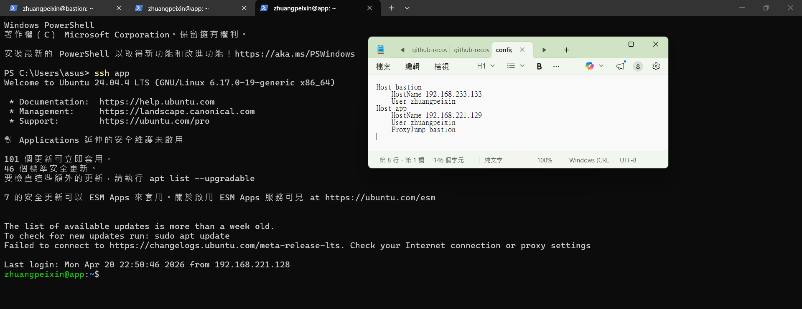

## 4. Part C：Docker 服務

> systemctl status docker
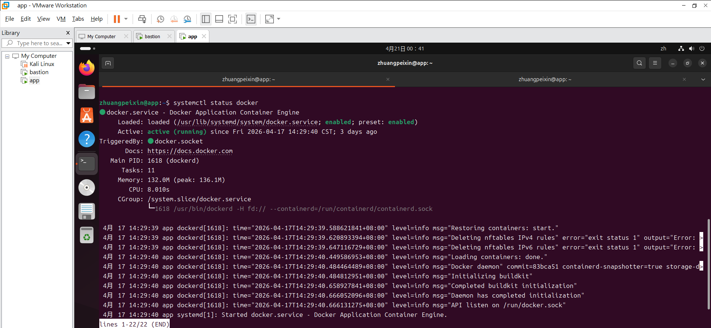

> curl(ufw 規則處理）
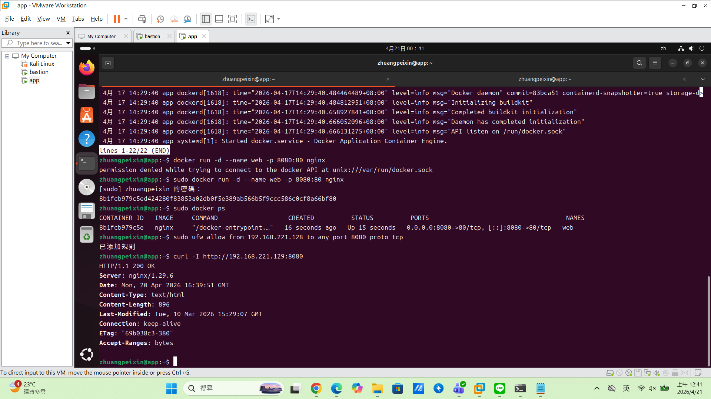

## 5. Part D：故障演練
### 故障 1：<F2 防火牆規則阻斷 SSH>
- 注入方式：
在 app執行`sudo ufw reset`清空規則並開啟 default deny，模擬管理員誤刪規則或防火牆配置錯誤，導致 SSH (Port 22) 通道被封鎖。

- 故障前：
確認初始狀態下 SSH連線暢通。在 Host端執行`ssh app`測試登入，並在 app端以`sudo ufw status`檢查規則是否存在。

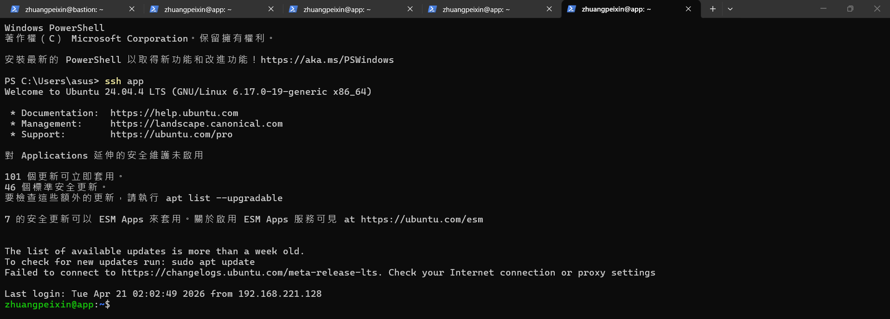
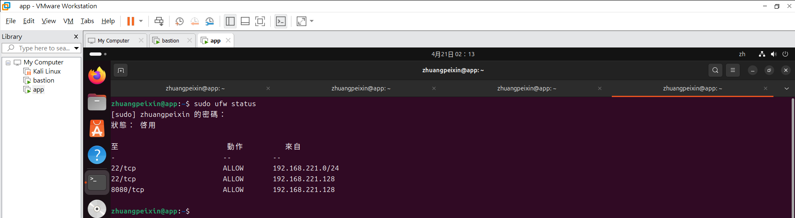

- 故障中：
(1)注入故障：清空規則，開啟 default deny與攔截。
(2)嘗試連線：`ssh app`出現Connection timed out卡住。
(3)測試 L3 連通性：在bastion執行`ping 192.168.221.129`。
(4)檢查網卡狀態：在app執行`ip link`，顯示網卡狀態為 UP。
(5)檢查防火牆：在app執行`sudo ufw status`，顯示 Status: active啓用且規則清單是空的。

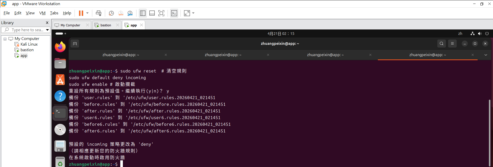
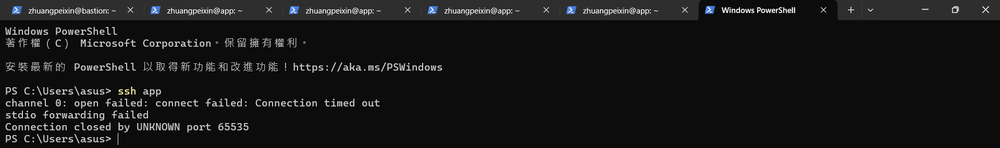
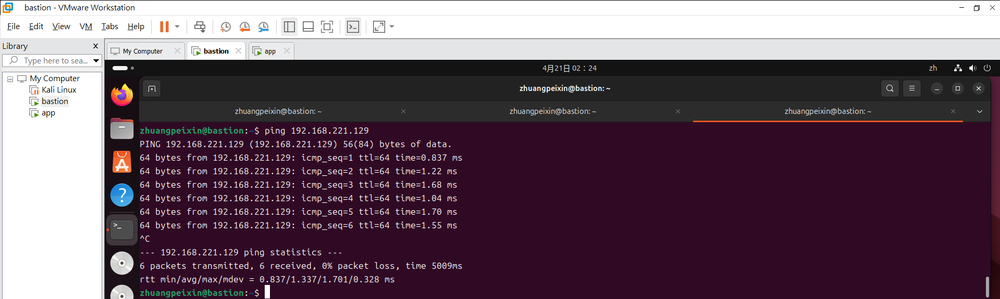
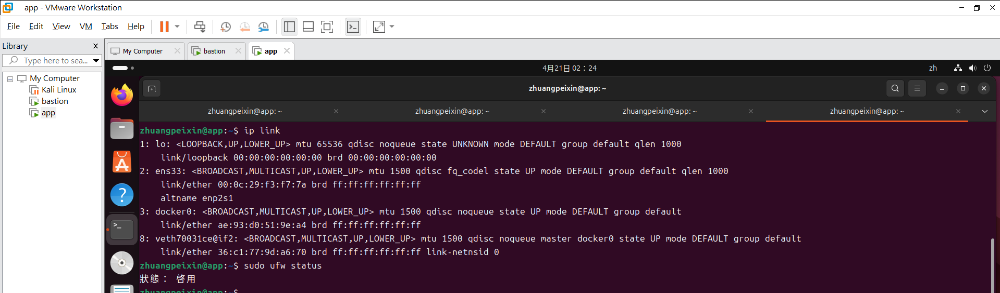

- 回復後：
在 app實體終端執行`sudo ufw allow from 192.168.221.128 to any port 22 proto tcp`重新放行連線，確認`ssh app`連線恢復。

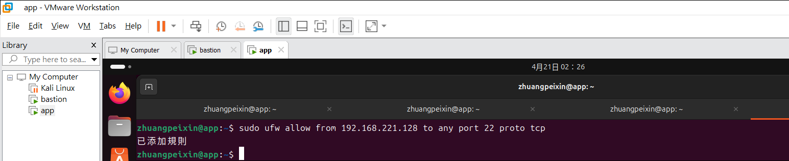
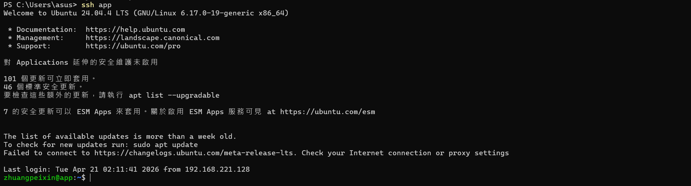

- 診斷推論：
當連線出現timeout時，透過ping與ip link證實網路路徑與實體介面均正常，因此排除L3網路層故障的可能性。由於SSH連線是無回應逾時而非被拒絕，配合ufw status發現無任何放行規則，判定此故障為L4防火牆規則攔截阻斷了tcp Port 22的三向交握。

### 故障 2：<F3 Docker服務停止>
- 注入方式：
在app執行`sudo systemctl stop docker`，模擬容器服務異常停止或未啟動的情境。

- 故障前：
確認Nginx容器正常，從bastion執行`curl -I http://192.168.221.129:8080`，看到HTTP/1.1 200 OK。並在app以`ss -tlnp`確認監聽狀態。

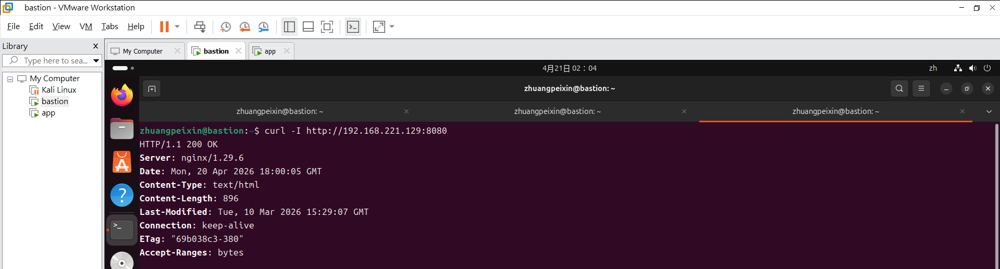
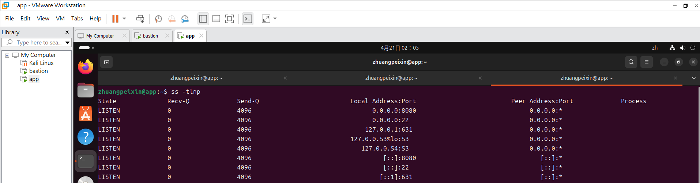

- 故障中：
(1)注入故障：`sudo systemctl stop docker`容器服務異常停止。
(2)測試服務：在bastion執行`curl -I http://192.168.221.129:8080`，噴出Couldn't connect to server (Connection refused)。
(3)檢查監聽埠口：在app執行`ss -tlnp`，發現8080埠口消失了。
(4)檢查防火牆：在app執行`sudo ufw status`，看到 8080 規則還是 ALLOW。
(5)檢查連線：在Host執行`ssh app`，連線還能成功。

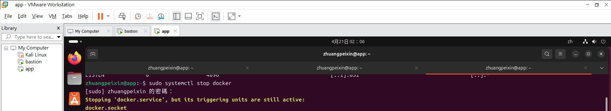
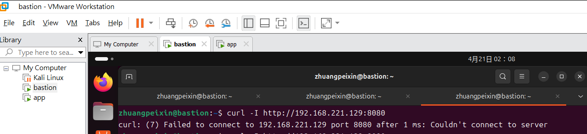
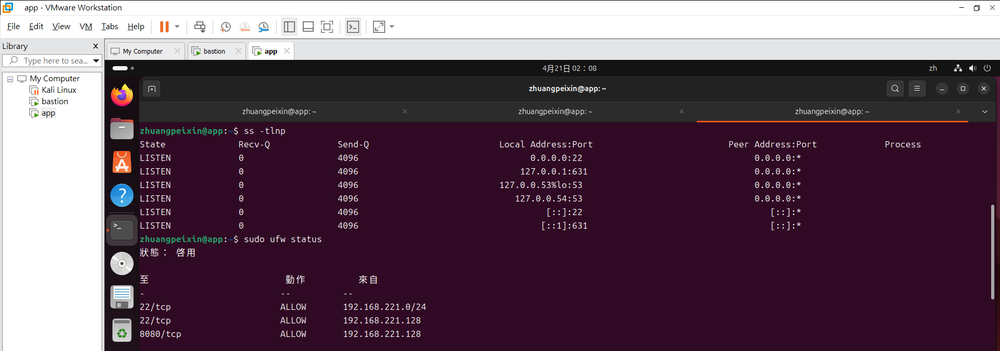
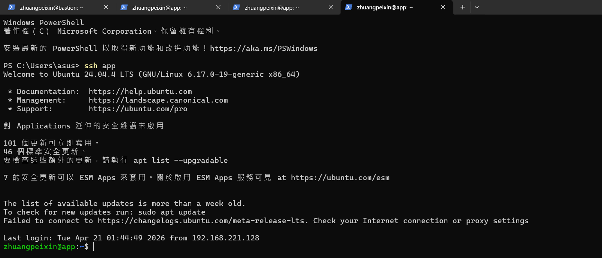

- 回復後：
在app執行`sudo systemctl start docker`恢復服務，驗證curl回到200 OK。

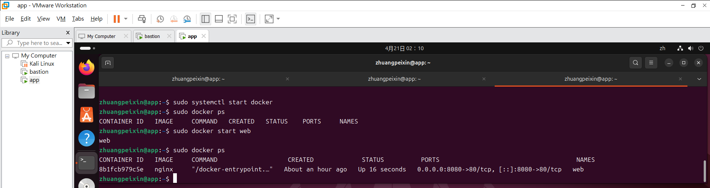
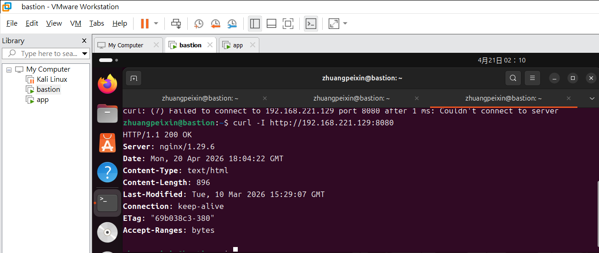

- 診斷推論：
連線失敗回傳Connection refused拒絕連線，代表主機已收到封包但無程式對接。經ss -tlnp檢查確認8080埠口未被監聽，但ufw status顯示防火牆規則正常，排除防火牆攔截問題。此外ssh app仍可正常登入，證明網路路徑通暢。SSH通但8080不通的現象，，判定故障發生在Service。

### 症狀辨識（若選 F1+F2 必答）
- 兩個都 timeout，我怎麼分？
- A:雖然F1和F2都會導致Connection timed out，但區分關鍵在於其L3網路層通性：若執行ping會通但ssh跑出逾時，代表底層網路正常，僅特定服務被擋，判定為防火牆F2攔截；若連ping都斷線不通，封包完全無法抵達目標主機，且進入主機查看ip link顯示網卡為DOWN或未取得 IP，則判定為F1網卡故障。

## 6. 反思（200 字）
- 這次做完，對『或「timeout 不等於壞了」的理解有什麼改變？
- A:以前沒有接觸過這些操作時，連線連不上就會以為是網路壞掉。但經過這幾次上課內容講解實作，我發現觀察報錯訊息的不同，其實藏著各種涵義線索。對於「分層隔離」，利用工具逐層排除的邏輯：ping來測試 L3網路層、ssh 測試 L4防火牆層，最後用curl與ss確認服務端，發現ssh能通但http不通時，可以判斷問題不是出在網路或防火牆，而是在應用程式本身。診斷故障是透過封包回傳的細微差異來定位問題點。而針對「timeout 不等於壞了」，在做防火牆時，我發現畫面卡住最後顯示timeout，不是對方的伺服器掛了，而是封包在路上被防火牆攔截後直接drop丟掉，導致發起端未收到任何回應，tcp交握超時。 而refused是主機明確拒絕，反而證明了L3網路層是通的，只是服務沒開。 

