# W02｜VMware 網路模式與雙 VM 排錯

## 網路配置

| VM | 網卡 | 模式 | IP | 用途 |
|---|---|---|---|---|
| dev-a | NIC 1 | NAT | （192.168.233.133） | 上網 |
| dev-a | NIC 2 | Host-only | （192.168.221.128） | 內網互連 |
| server-b | NIC 1 | Host-only | （192.168.221.129） | 內網互連 |

> dev-a
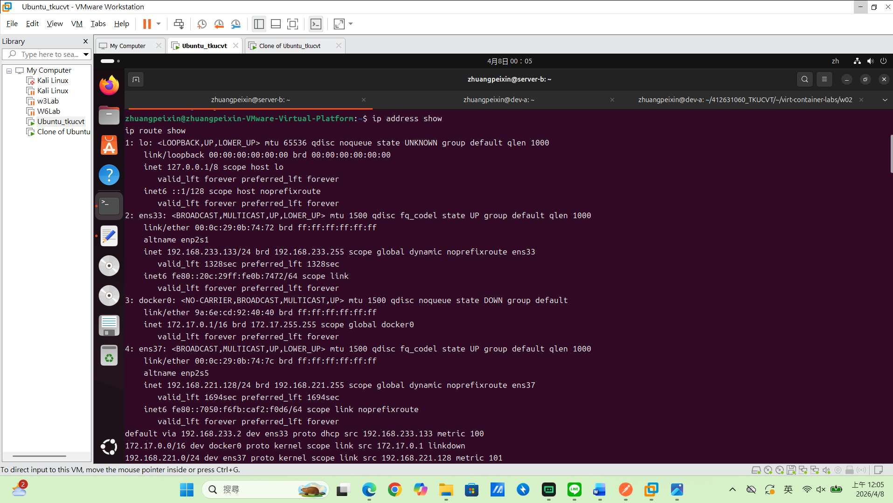

> server-b
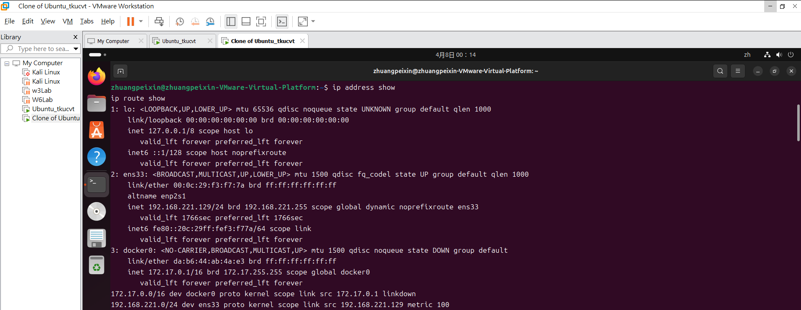

## 連線驗證紀錄

- [x] dev-a NAT 可上網：`ping google.com` 輸出

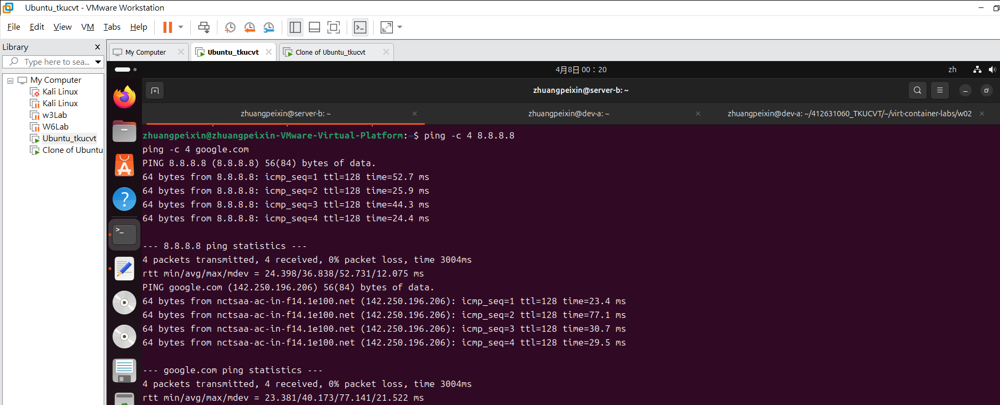

- [x] 雙向互 ping 成功：貼上雙方 `ping` 輸出

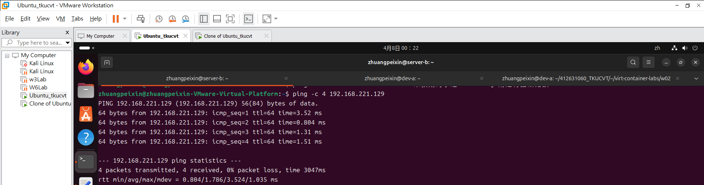
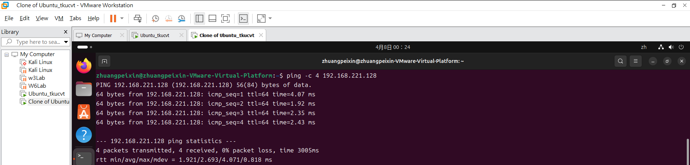

- [x] SSH 連線成功：`ssh <user>@<ip> "hostname"` 輸出

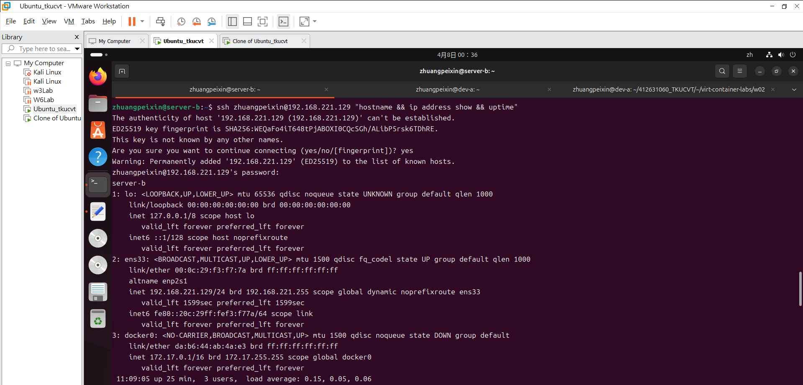

- [x] SCP 傳檔成功：`cat /tmp/test-from-dev.txt` 在 server-b 上的輸出

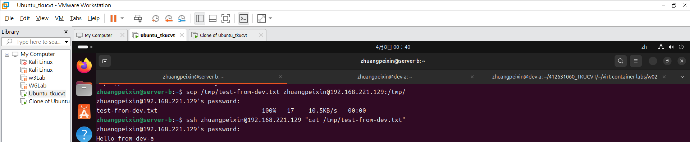

- [x] server-b 不能上網：`ping 8.8.8.8` 失敗輸出

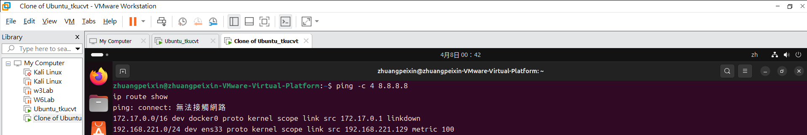

## 故障演練一：介面停用

| 項目 | 故障前 | 故障中 | 回復後 |
|---|---|---|---|
| server-b 介面狀態 | UP | DOWN | （UP） |
| dev-a ping server-b | 成功 | 失敗 | （成功） |
| dev-a SSH server-b | 成功 | 失敗 | （成功） |

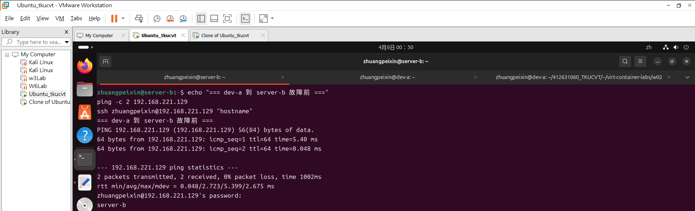
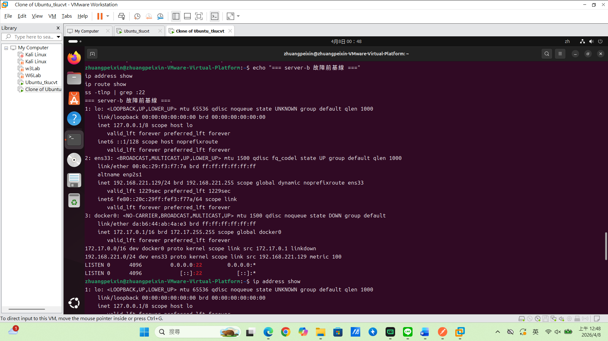
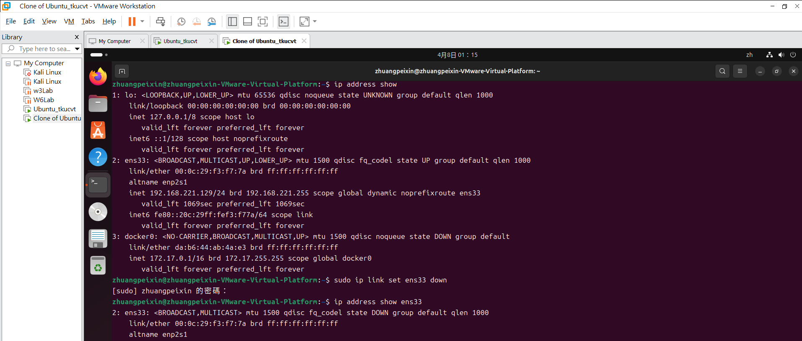
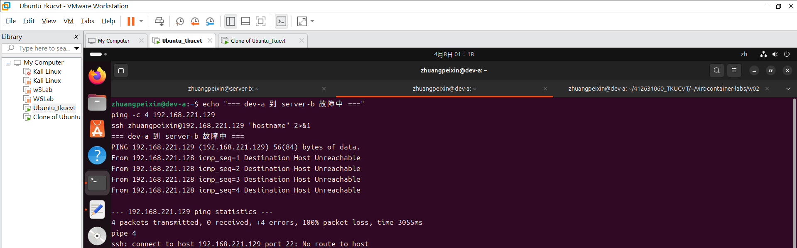
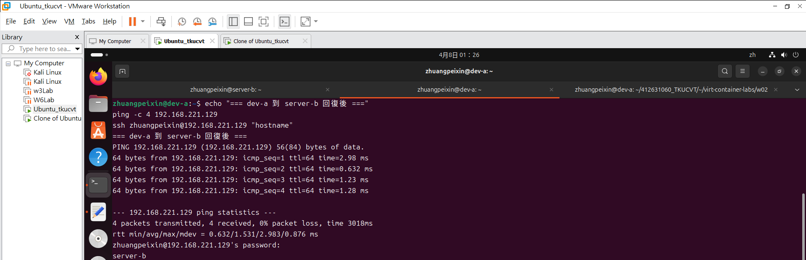

## 故障演練二：SSH 服務停止

| 項目 | 故障前 | 故障中 | 回復後 |
|---|---|---|---|
| ss -tlnp grep :22 | 有監聽 | 無監聽 | （有監聽） |
| dev-a ping server-b | 成功 | 成功 | （成功） |
| dev-a SSH server-b | 成功 | Connection refused | （成功） |

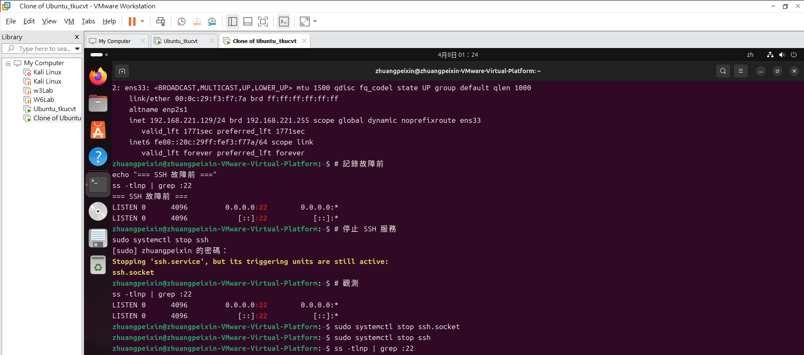
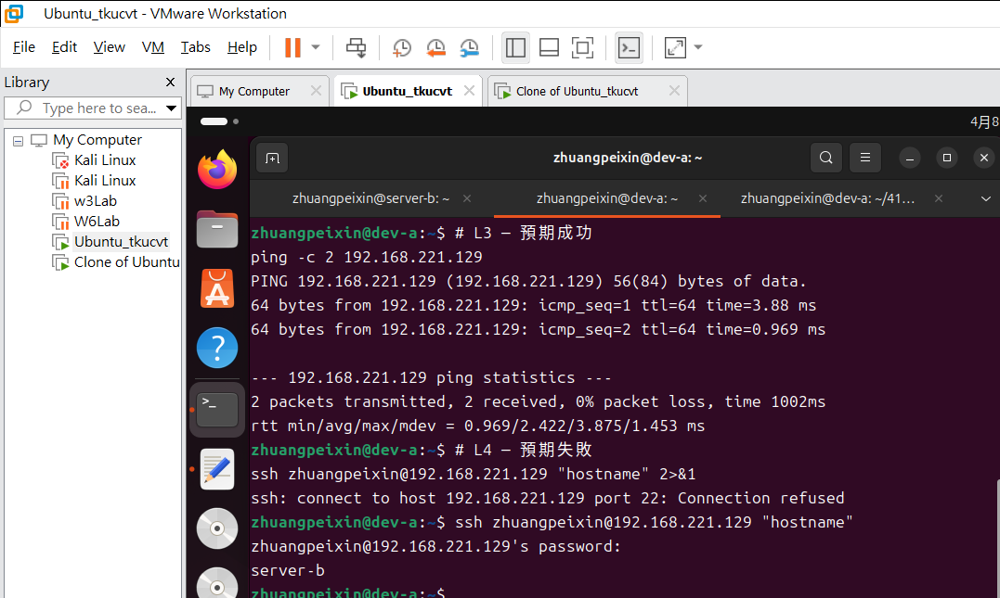

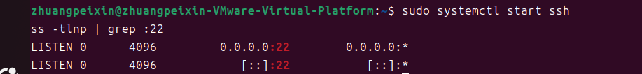

## 排錯順序
（寫出你的 L2 → L3 → L4 排錯步驟與每層使用的命令）
第1步.L2資料連結層-物理與界面狀態：檢查網卡是否開啟、介面是否UP、是否拿到IP
使用命令：ip address show

第2步.L3網路層-IP連通：檢查封包是否能傳遞到達對端、路由是否正確
使用命令：ip route show -> ping -c 2 <peer-host-only-ip>

第3步.L4傳輸層-服務監聽：檢查SSH服務是否在運作、是否在監聽、連線是否被拒絕
使用命令：ss -tlnp | grep :22 -> ssh <user>@<peer-host-only-ip> "hostname"

## 網路拓樸圖
（嵌入或連結 network-diagram.png）

## 排錯紀錄
- 症狀：我在 dev-a執行ping -c 2 <server-b-host-only-ip>測試連線正常，但進行 SSH連線時執行ssh <server-b-user>@<server-b-host-only-ip> "hostname" 2>&1，系統卻回傳Connection refused。
- 診斷：因為可以ping成功，代表 L2/L3網路層連通性沒錯，故障點應該在 L4傳輸層，我在 server-b執行ss -tlnp | grep :22檢查服務監聽狀態，卻未看到port 22的監聽。
- 修正：在 server-b重新啟動回復 SSH服務，執行sudo systemctl start ssh。
- 驗證：當我再次在server-b執行 ss -tlnp | grep :22時，確認出現監聽紀錄；到dev-a執行ssh <server-b-user>@<server-b-host-only-ip> "hostname"時連線恢復正常了。

## 設計決策
Q:為什麼 server-b 只設 Host-only 不給 NAT？
A:Host-only是內網連線，無法上網，確保 server-b不會直接暴露在網際網路上，減少被外界隨意連上被駭客入侵的風險，只有在同個網段裡的dev-a才能連上它，這樣的配置方法提升了安全性。不受外部 DHCP 影響、IP配置穩定的特性，很適合做可重現的隔離實驗環境。
