# W03｜多 VM 架構：分層管理與最小暴露設計

## 網路配置

| VM | 角色 | 網卡 | 模式 | IP | 開放埠與來源 |
|---|---|---|---|---|---|
| bastion | 跳板機 | NIC 1 | NAT | （192.168.233.133） | SSH from any |
| bastion | 跳板機 | NIC 2 | Host-only | （192.168.221.128） | — |
| app | 應用層 | NIC 1 | Host-only | （192.168.221.129） | SSH from 192.168.221.0/24 |
| db | 資料層 | NIC 1 | Host-only | （192.168.221.130） | SSH from app + bastion |

> bastion
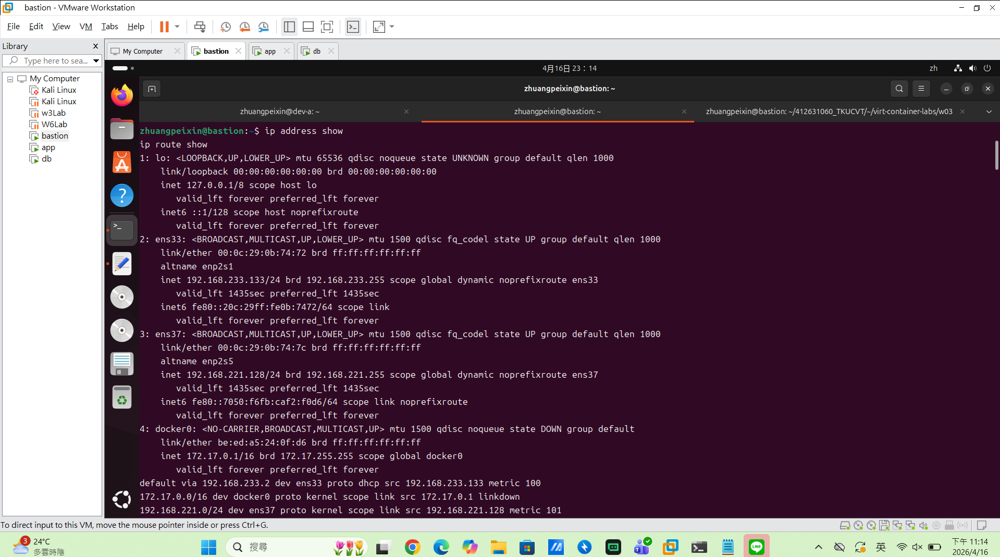

> app
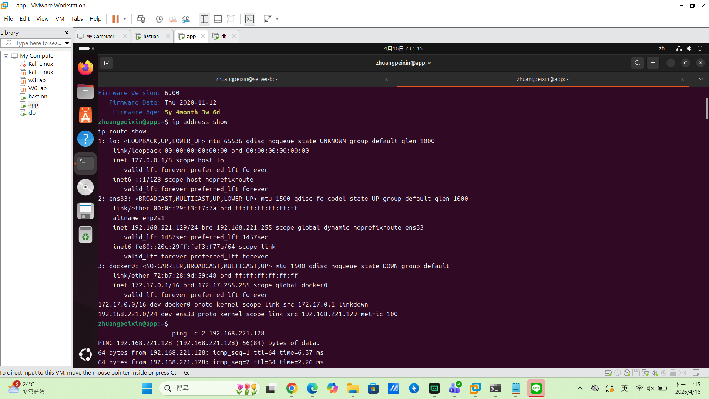

> db
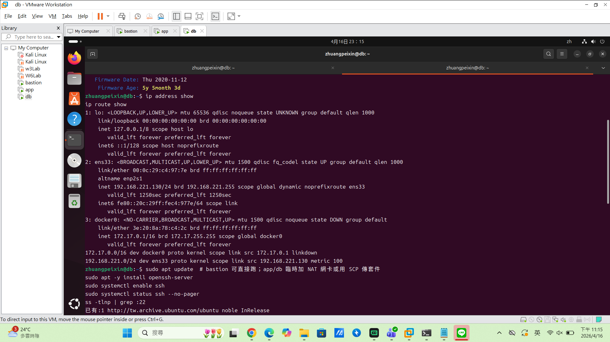

## SSH 金鑰認證

- 金鑰類型：（例：ed25519）

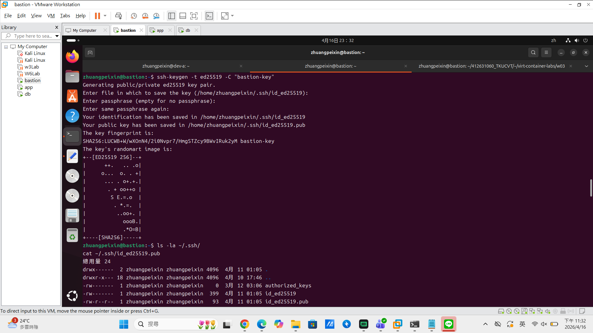

- 公鑰部署到：（例：app 和 db 的 ~/.ssh/authorized_keys）

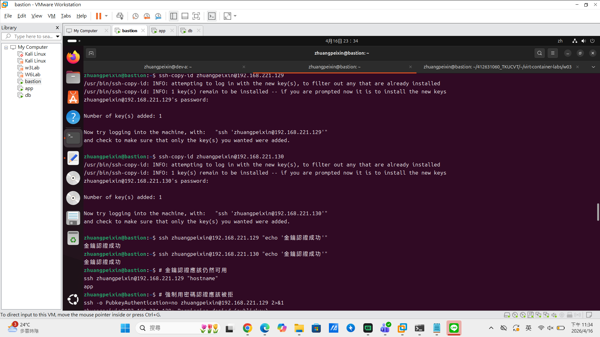
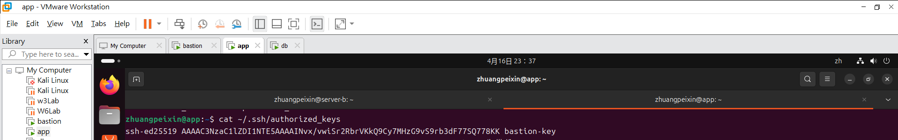

- 免密碼登入驗證：
  - bastion → app：（貼上輸出）
  - bastion → db：（貼上輸出）

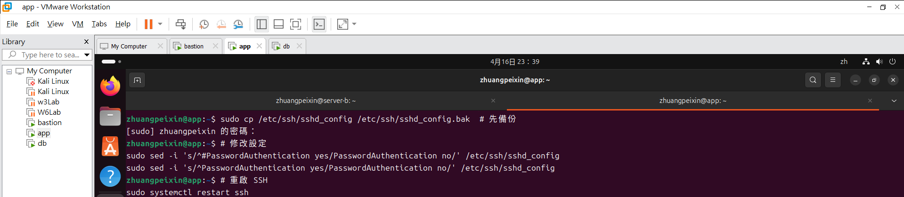
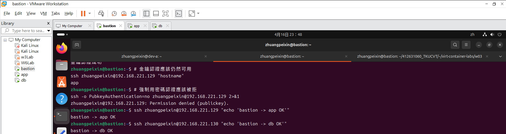

## 防火牆規則

### app 的 ufw status
（貼上 `sudo ufw status verbose` 輸出）

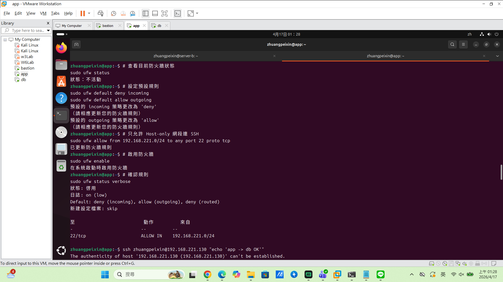

### db 的 ufw status
（貼上 `sudo ufw status verbose` 輸出）

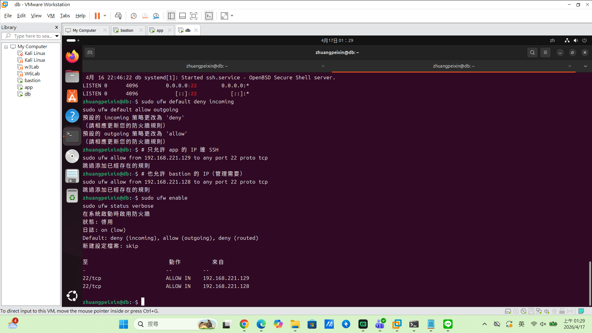

### 防火牆確實在擋的證據
（貼上步驟 13 的 curl 8080 失敗輸出）

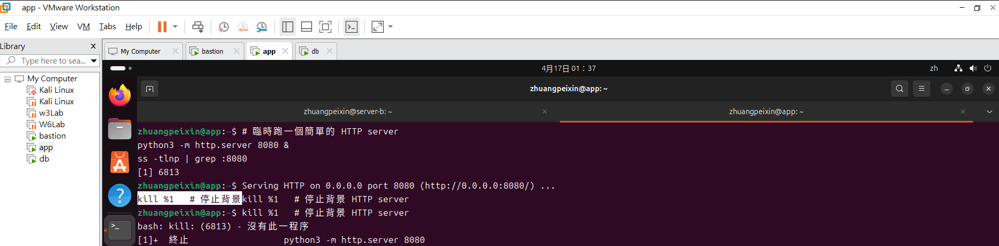
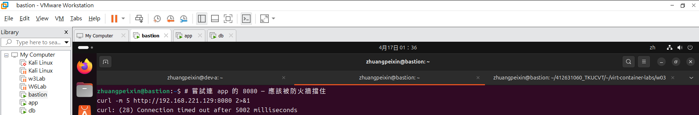

## ProxyJump 跳板連線
- 指令：（貼上你使用的 ssh -J 或 ssh config 設定）

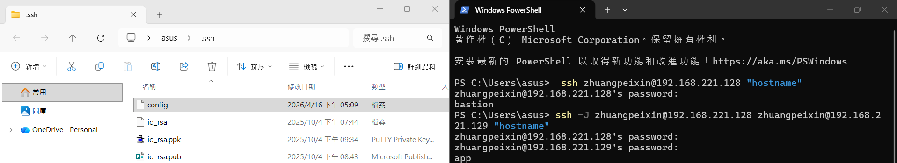

- 驗證輸出：（貼上連線成功的 hostname 輸出）

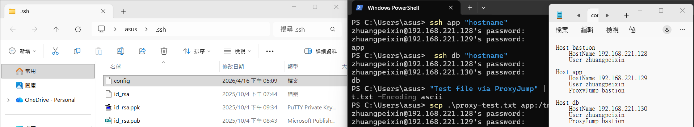

- SCP 傳檔驗證：（貼上結果）

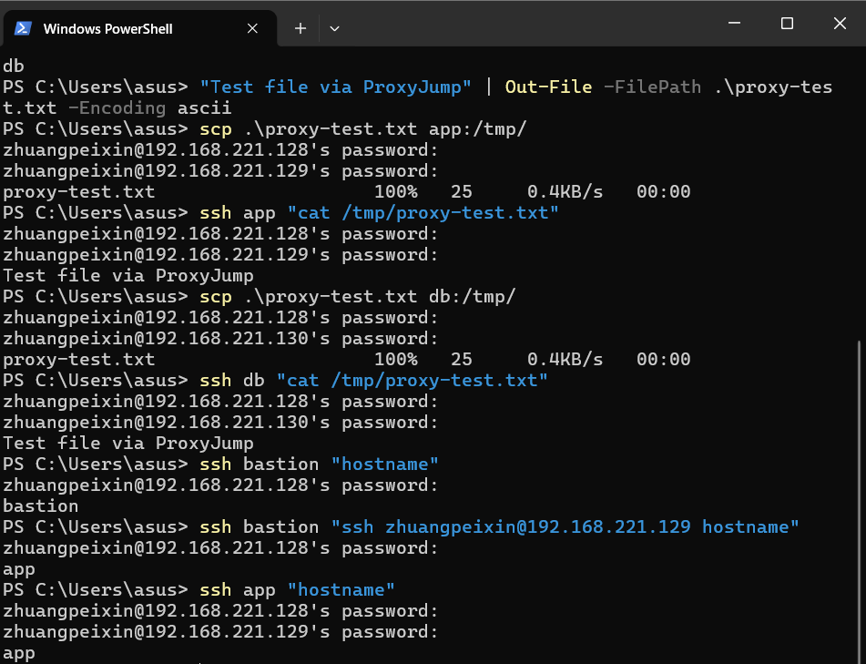

## 故障場景一：防火牆全封鎖

| 項目 | 故障前 | 故障中 | 回復後 |
|---|---|---|---|
| app ufw status | active + rules(allow 22) | deny all | （active + rules(allow 22)） |
| bastion ping app | 成功 | （成功） | （成功） |
| bastion SSH app | 成功 | **timed out** | （成功） |

> 故障前
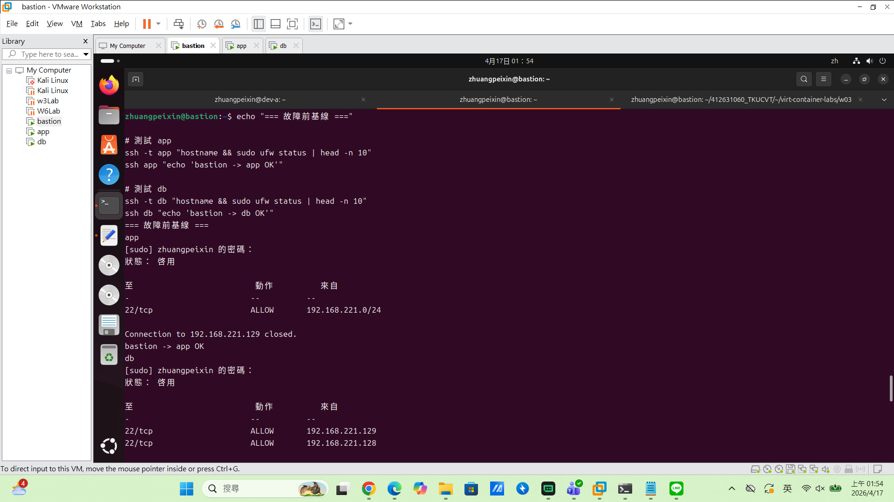

> 故障中
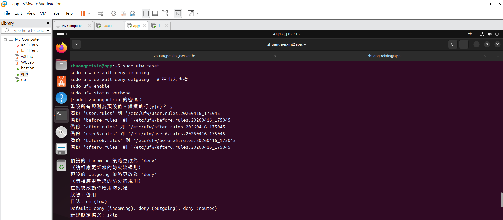
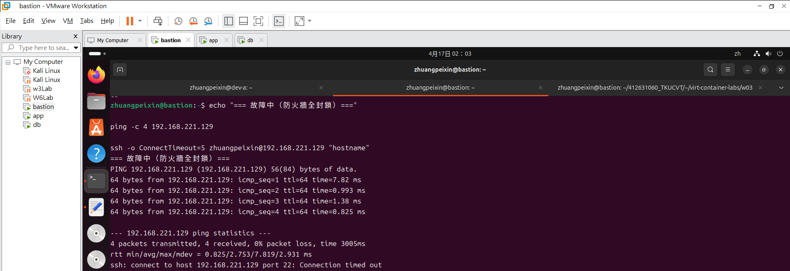

> 回復
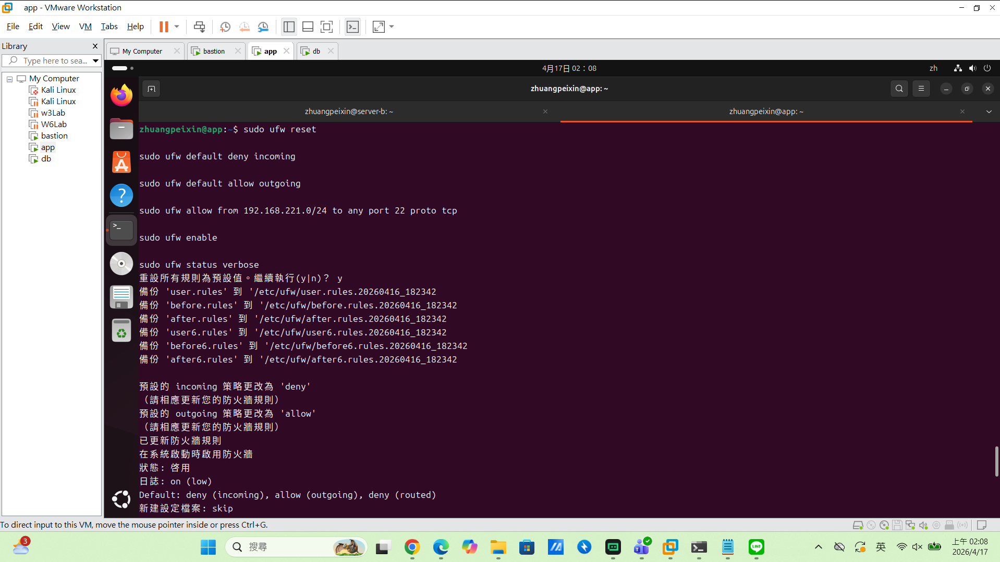

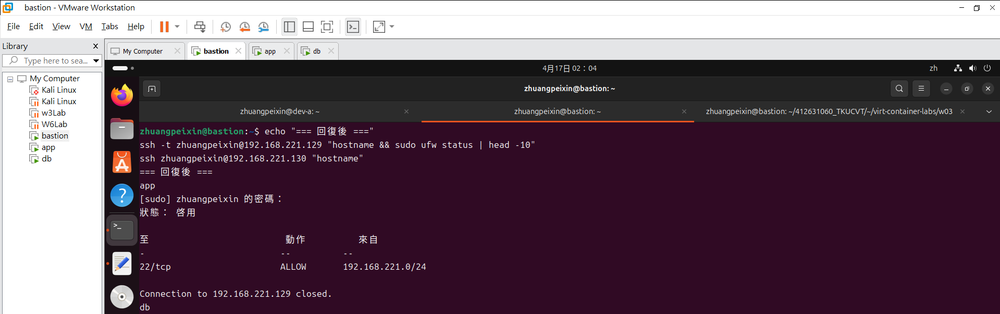

## 故障場景二：SSH 服務停止

| 項目 | 故障前 | 故障中 | 回復後 |
|---|---|---|---|
| ss -tlnp grep :22 | 有監聽 | 無監聽 | （有監聽） |
| bastion ping app | 成功 | 成功 | （成功） |
| bastion SSH app | 成功 | **refused** | （成功） |

> 故障前
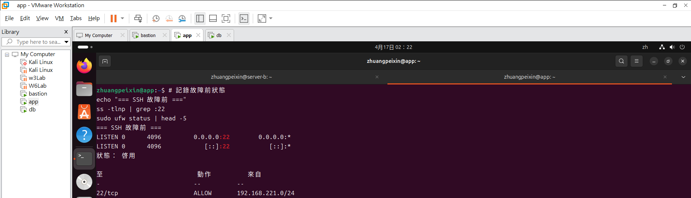

> 故障中
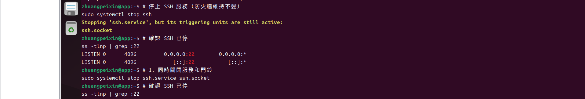
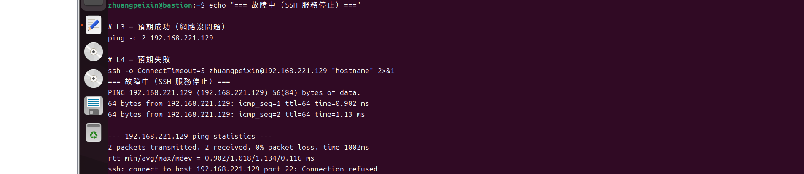

> 回復

## timeout vs refused 差異

- 1.Connection timeout 連線超時 -> 防火牆攔截
：ping成功但 SSH連線卡住一段時間後，沒有得到任何回應，而噴出 timed out ->
封包到達主機後被防火牆規則直接丟棄(Drop)，發起端未收到任何回應，導致 TCP交握超時。
*排錯方向：L3網路層問題，須檢查防火牆與安全組規則。

- 2.Connection refused 連線被拒絕 -> 服務端異常
：ping成功但 SSH連線立即回傳 refused ->
封包順利到達目標主機，但Port 22埠沒有任何程序在監聽，作業系統會主動回傳RST封包告知連線被拒絕。
*排錯方向：L4傳輸層問題，服務沒跑或埠錯，須檢查SSH服務狀態是否啟動、當機與監聽port是否正確。

## 網路拓樸圖

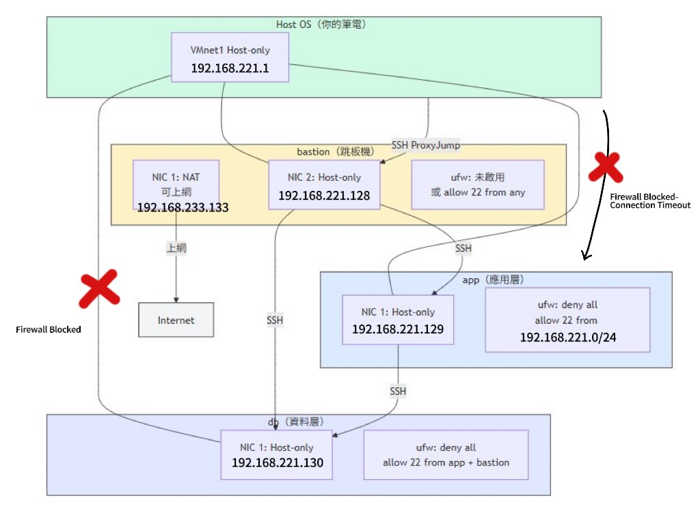

## 排錯紀錄
- 症狀：當我嘗試注入 SSH服務故障時，執行 `sudo systemctl stop ssh`後，預期應該要連不到了，但執行#確認 SSH已停`ss -tlnp | grep :22`時，跑出來發現竟然還能連線。

- 診斷：在`sudo systemctl stop ssh`時，有跑出一段黃色警示字`Stopping 'ssh.service', but its triggering units are still active:ssh.socket`，提到 ssh.socket仍處於 active。反應出Ubuntu有自動喚醒機制，只要有連線進來，Socket就會把 SSH 服務再拉起來。

- 修正：改為執行＃同時關閉服務和門鈴`sudo systemctl stop ssh.service ssh.socket`，徹底切斷監聽源。

- 驗證：最後再次執行 `ss -tlnp | grep :22`確認了 Port 22確實消失了，且連線時出現 Connection refused，成功達成故障注入實驗。

## 設計決策

- Q:為什麼 db 允許 bastion 直連而不是只允許從 app 跳？
- A:

