# W06｜Docker Image 與 Dockerfile

## 映像組成
- Layers 是什麼：映像檔內一堆唯讀的壓縮檔tarball，紀錄了每次指令對檔案系統所做的差異變更。

- Config 是什麼：一份 JSON 格式的設定檔，主要紀錄容器啟動時的預設行為與metadata，例如預設執行命令CMD/ENTRYPOINT、工作目錄WorkingDir、環境變數Env與暴露埠 Expose...等。

- Manifest 是什麼：最外層的清單檔案，負責把Config設定檔與所有的Layers綁在一起，並明確記錄每個Layer的雜湊值digest和檔案大小。

## python:3.12-slim inspect 摘錄
- Config.Cmd：["python3"] 

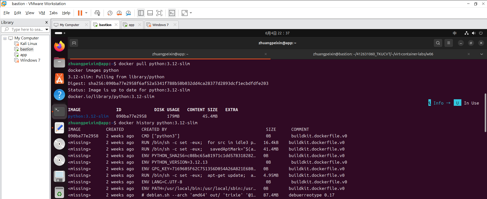

- Config.Env：
           [
                "PATH=/usr/local/bin:/usr/local/sbin:/usr/local/bin:/usr/sbin:/usr/bin:/sbin:/bin",
                "LANG=C.UTF-8",
                "GPG_KEY=7169605F62C751356D054A26A821E680E5FA6305",
                "PYTHON_VERSION=3.12.13",
                "PYTHON_SHA256=c08bc65a81971c1dd5783182826503369466c7e67374d1646519adf05207b684"
            ]
- Config.WorkingDir："" (預設為空)
- RootFS.Layers 數量：4層

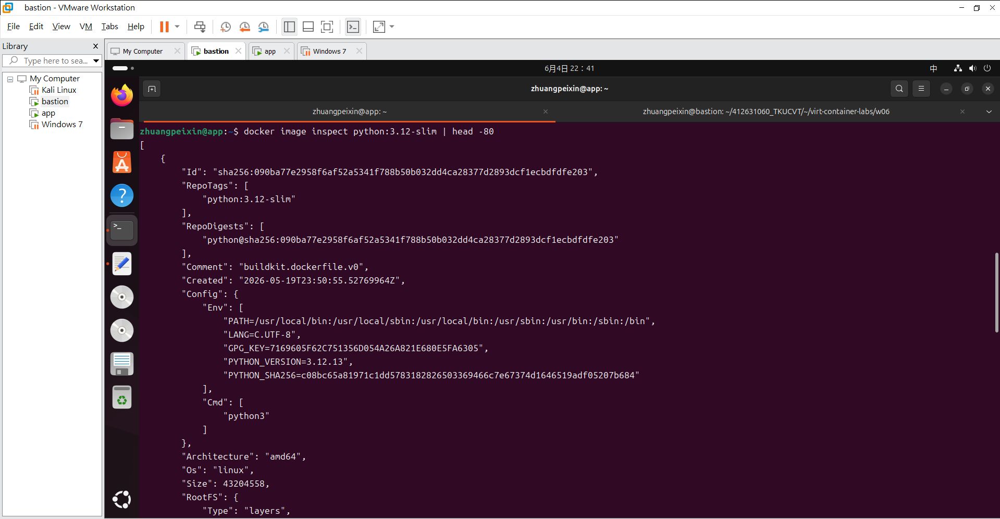
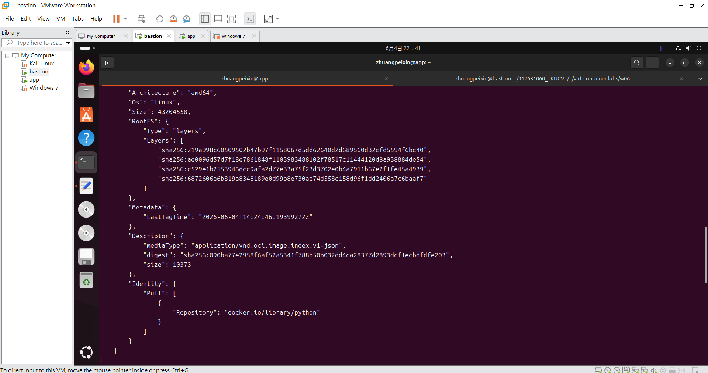

## Layer 快取實驗
| 情境 | build 時間 |
|---|---|
| v1 首次 build | （0m9.338s） |
| v1 改 app.py 後 rebuild | （0m7.520s） |
| v2 首次 build | （0m6.437s） |
| v2 改 app.py 後 rebuild | （0m0.365s） |

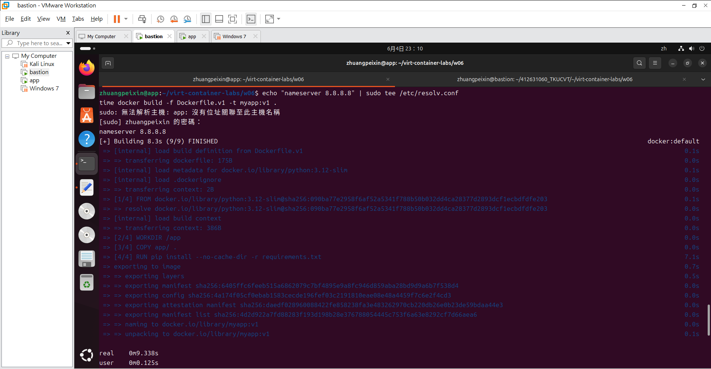
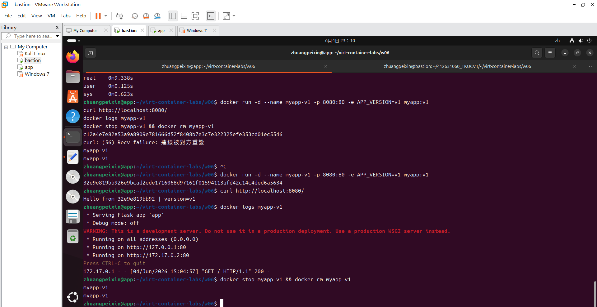

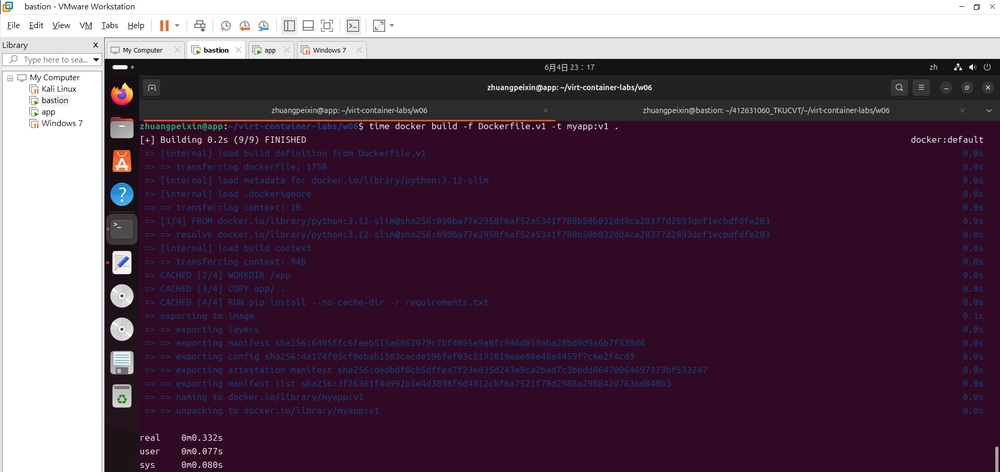

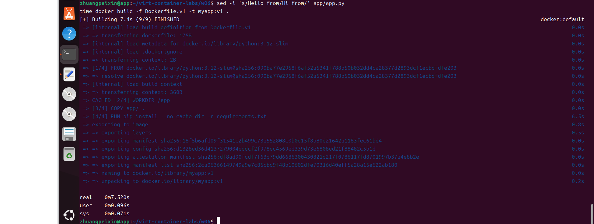

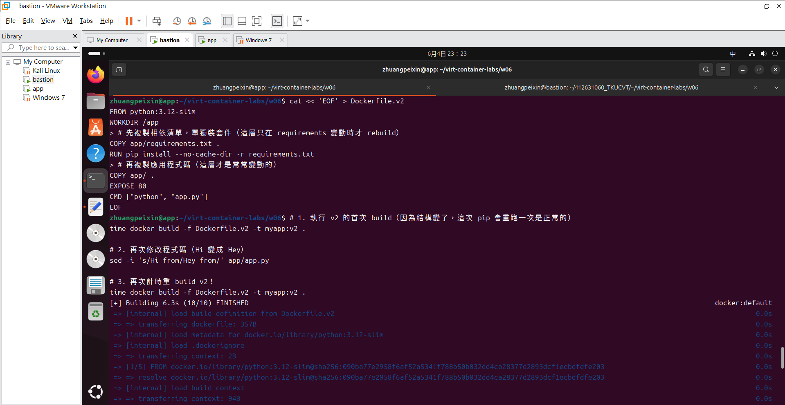
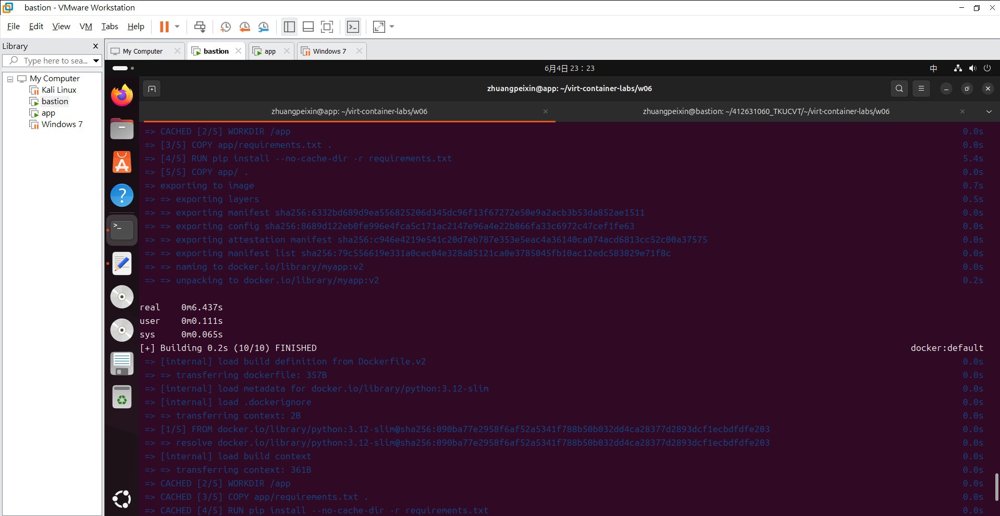

- Q: 觀察：為什麼 v2 的 rebuild 這麼快？
- A: 因為在v1時是整個一起複製，若改變程式碼則要pip instal全部要重跑使得耗時。在v2裡，我們把不會變的 requirements.txt和一直需要改的app.py分開複製。這次我們只改了 app.py的程式碼，Docker往下檢查時發現 requirements.txt沒動過，所以就直接拿之前做好的快取CACHED來用，跳過最浪費時間的安裝過程，所以速度變更加快速了。

## CMD vs ENTRYPOINT 實驗
| 寫法 | `docker run ` 輸出 | `docker run  extra1 extra2` 輸出 |
|---|---|---|
| CMD shell form | (`argv = ['show_args.py', 'default1', 'default2'] PID  = 7`) | （`docker: Error response from daemon: failed to create task for container: failed to create shim task: OCI runtime create failed: runc create failed: unable to start container process: error during container init: exec: "extra1": executable file not found in $PATH`） |
| CMD exec form | （`argv = ['show_args.py', 'default1', 'default2'] PID  = 1`） | （`docker: Error response from daemon: failed to create task for container: failed to create shim task: OCI runtime create failed: runc create failed: unable to start container process: error during container init: exec: "extra1": executable file not found in $PATH`） |
| ENTRYPOINT + CMD | （`argv = ['show_args.py', 'default1', 'default2'] PID  = 1`） | （`argv = ['show_args.py', 'extra1', 'extra2'] PID  = 1`） |

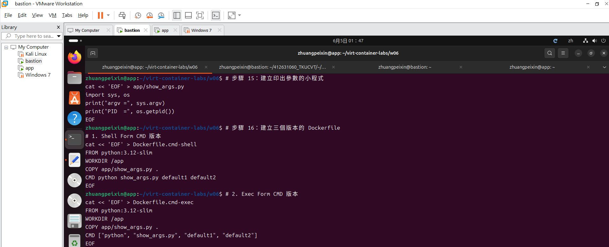
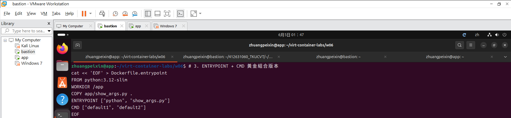

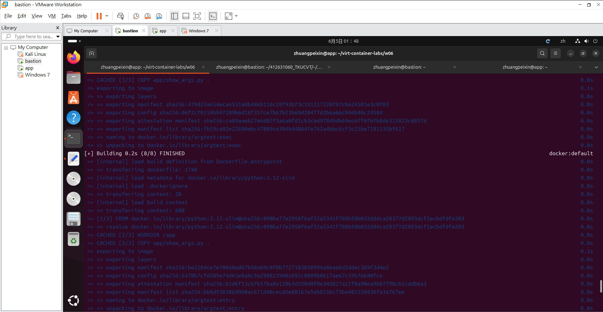

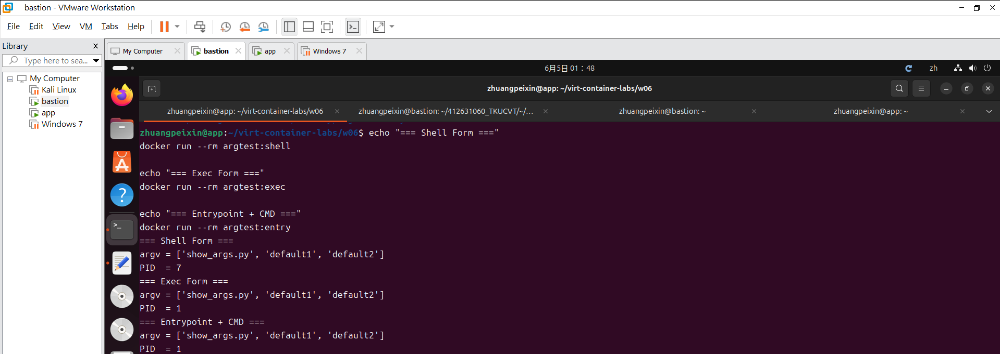

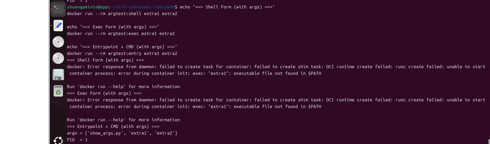

- 結論：ENTRYPOINT+CMD是最穩定的組合，跑主程式時，就會以PID 1安全啟動，能正常接收系統關閉訊號SIGTERM；而CMD在這時會變成預設參數，當使用者在外部帶入額外參數:extra1、extra2時，只會彈性覆蓋掉CMD的內容且直接附加在主指令後方跑，程式不會因為找不到指令而壞掉。

## Multi-stage 大小對照
| Image | SIZE |
|---|---|
| python:3.12（builder base） | （1.62GB) |
| python:3.12-slim（runtime base） | （179MB） |
| myapp:v2（單階段） | （197MB） |
| myapp:multi（多階段） | （184MB） |

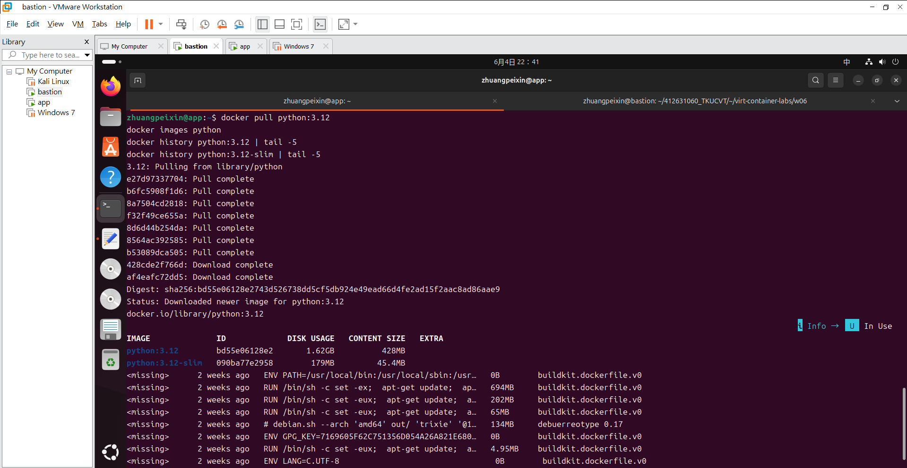
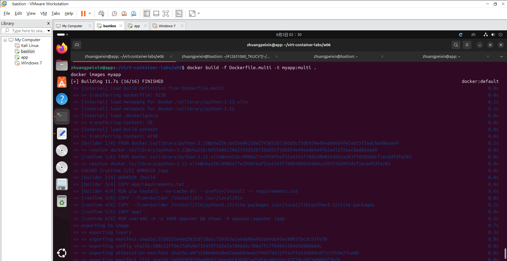
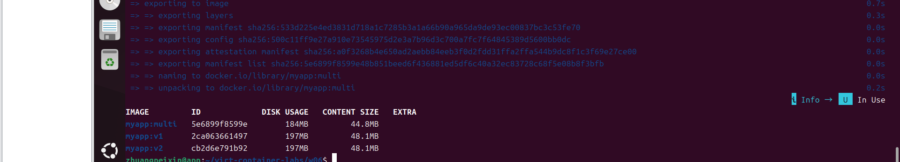

- 解釋：builder stage 的 layer 去哪了？
- 因為多階段建置的特性是每個階段都獨立分開，最終產出的myapp:multi只會保留下最後一個runtime stage的檔案系統層layers。第一階段builder stage的 layers因為沒有被打包進最終的映像檔，所以就被docker留在底層當作快取了，讓我們下次 build 時可以重用且加速，但在最終的映像檔列表、docker history裡就不會包含它們。

## .dockerignore 故障注入
| 項目 | 故障前 | 故障中 | 回復後 |
|---|---|---|---|
| du -sh . | （44K） | （151M） | （151M） |
| build context 傳輸大小 | （129M） | （129M） | （129M） |
| build 時間 | （約0.6s） | （約0M3.013s） | (約0M1.175s） |

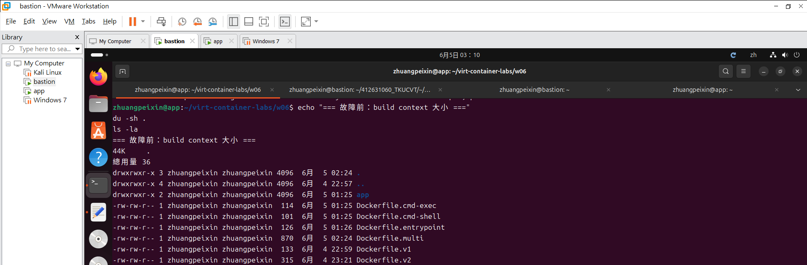
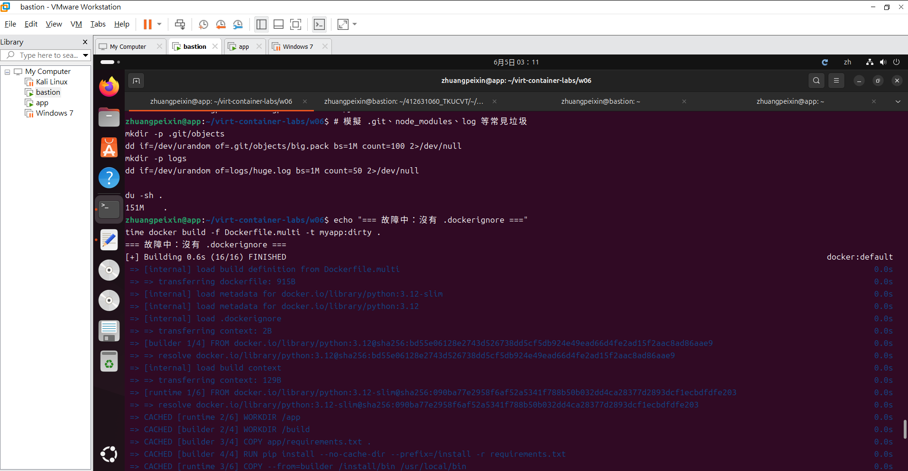
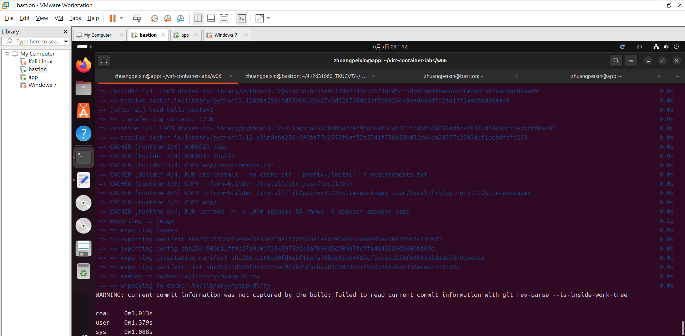
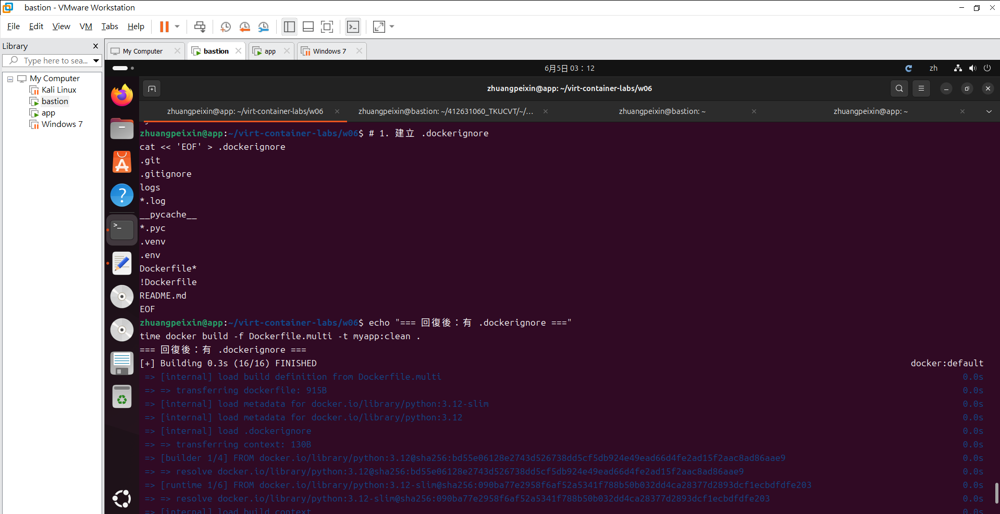
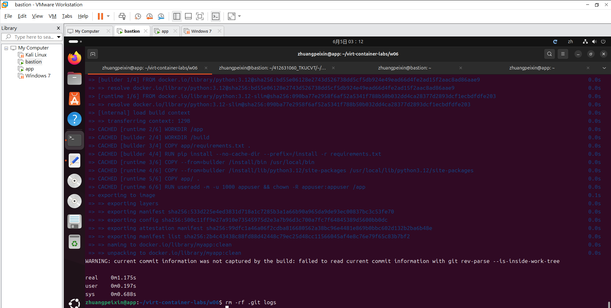

## 排錯紀錄
- 症狀：
- 診斷：
- 修正：
- 驗證：

## 設計決策
（說明本週至少 1 個技術選擇與取捨，例如：為什麼 runtime 選 `python:3.12-slim` 而不是 `alpine`？）
